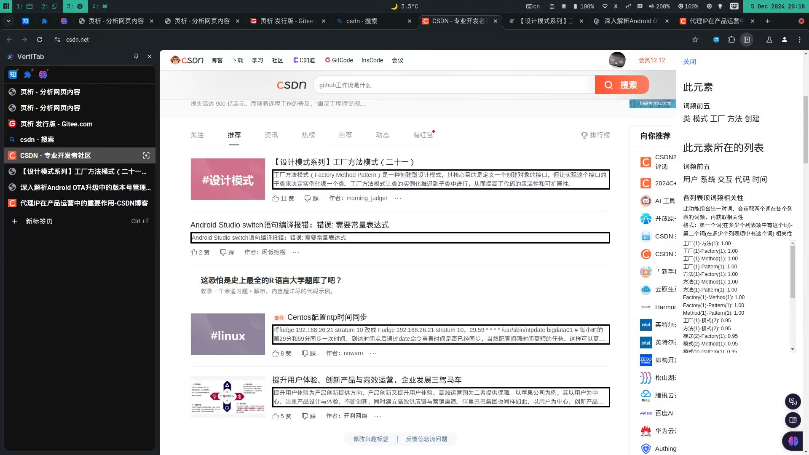

# 简介
页析是一个浏览器扩展，分析网页内容，基本功能还没做好
- 由一名初中生开发 
- 可以选择网页中的一个列表分析，获取某个列表项的词频、整个列表的词频、各个列表项中某个词的词频与另一个词的词频的相关性
- 获取整个网页的词频的词云图
- 使用MIT许可
- 不保证此软件结果准确
# 使用方法
点击扩展在浏览器顶部的图标可以查看本网页频繁出现的词的词频，这时候会显示整个网页的词频的词云图，再点击选择元素单独分析，再点击网页中的列表的某个列表项可以分析这个列表项和这个列表。
# 截图

